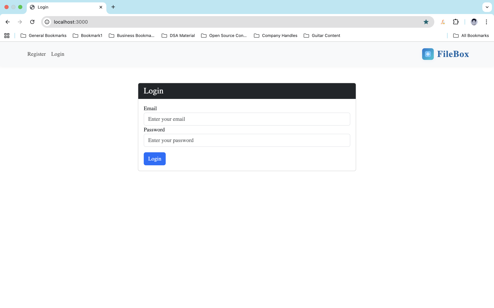
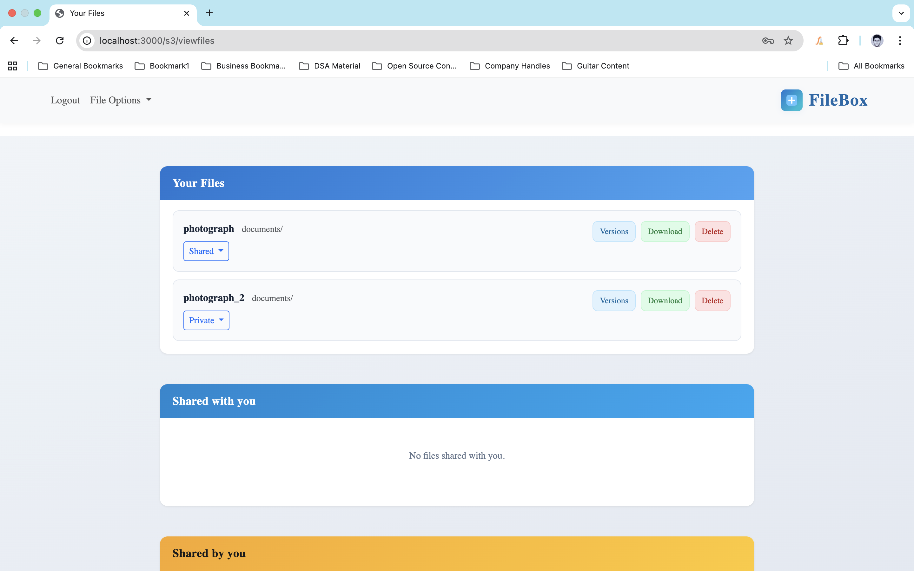
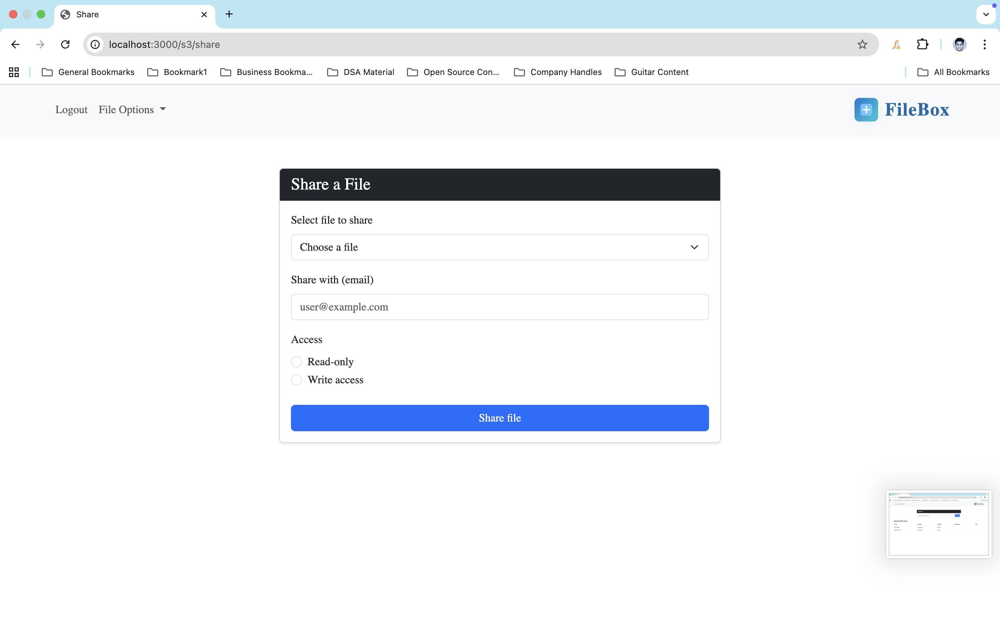

# Cloud Storage Management Application

A full-stack web application for managing files in the cloud: upload, organize, share with others, control visibility, and keep previous versions. Built with Node.js, Express, EJS, and PostgreSQL (or MySQL).


---

## Features

- **User authentication** — Register and log in with email and password (bcrypt, JWT in session).
- **File upload** — Upload files with name, location, description, tag, and access type (Public / Private / Shared).
- **Your files** — View all your files in a responsive, div-based layout with visibility dropdown (Public / Private / Shared).
- **Version history** — View and download previous versions of a file.
- **Sharing** — Share files with other users by email; grant Read-only or Write access.
- **Shared with you** — See files others have shared with you; download (and delete if you have write access).
- **Shared by you** — Manage shares: change access or remove sharing.
- **Download & delete** — Download any file you own or have access to; delete with confirmation.
- **Search** — Search your files by name, description, or tag.

---

## Tech Stack

| Layer        | Technology                          |
| ------------ | ------------------------------------ |
| Runtime     | Node.js                              |
| Framework   | Express.js                           |
| View engine | EJS                                  |
| Database    | PostgreSQL (config supports MySQL)   |
| ORM         | Sequelize                            |
| Auth        | JWT (session), bcrypt                |
| File upload | Multer                               |
| Styling     | Bootstrap 5                         |

---

## Prerequisites

- [Node.js](https://nodejs.org/) (v14 or later)
- [PostgreSQL](https://www.postgresql.org/) or [MySQL](https://www.mysql.com/)
- [Git](https://git-scm.com/)

---

## Setup

### 1. Clone the repository

```bash
git clone <your-repo-url>
cd Capstone_Project
```

### 2. Install dependencies

```bash
npm install
```

### 3. Database configuration

Create a database (PostgreSQL or MySQL) and update `src/configs/mysqldb.js`:

- **Host** — e.g. `localhost`
- **Database name** — e.g. `capstone-project`
- **Username** and **password**
- **Dialect** — `postgres` or `mysql2` (and use the matching driver)

The app uses Sequelize and will create/sync tables on startup.

### 4. Uploads folder

Ensure an `uploads` folder exists at the **project root** (where Multer saves files). Create it if needed:

```bash
mkdir -p uploads
```

### 5. Start the application

```bash
npm start
```

Or:

```bash
npm run dev
```

The server runs at **http://localhost:3000**.

---

## Usage

### Login & register

- **/** or **/user/login** — Log in with email and password.
- **/user/register** — Create an account (name, email, password).



After login you are redirected to **Your Files**.

### Your files

- **/s3/viewfiles** — Lists:
  - **Your Files** — Name, location, description, tag, access; change visibility (Public/Private/Shared), view versions, download, delete.
  - **Shared with you** — Files shared with you; download (and delete if you have write access).
  - **Shared by you** — Files you shared; change access or remove share.



### Upload

- **/s3/upload** — Upload a file with name, location, access type, optional description and tag.


### Share

- **/s3/share** — Pick a file, enter the recipient’s email, choose Read-only or Write access, and submit.


### Search

- **/s3/searchfile** — Search your files by keyword (name, description, tag).


### Other screens

- **/s3/download** — Download a file by ID.
- **/s3/delete** — Delete a file (with confirmation).
- **/s3/visibility** — Set file visibility (Public/Private/Shared).
- **Previous versions** — From “Your Files,” use “Versions” to view and download older versions.



---

## Project structure

```
Capstone_Project/
├── src/
│   ├── app.js                 # Express app, session, routes
│   ├── configs/
│   │   └── mysqldb.js         # Sequelize DB config
│   ├── middleware/
│   │   └── s3middleware.js    # Auth, upload, delete, share, visibility, download, search
│   ├── models/
│   │   └── Models.js          # User, FileStore, SharedUserStore, VersionStore
│   ├── public/
│   │   └── css/               # viewfiles.css, searchfile.css
│   ├── routes/
│   │   ├── userRoutes.js      # Register, login
│   │   └── s3Routes.js        # Upload, viewfiles, share, download, delete, visibility, search, versions
│   └── views/                 # EJS templates (login, register, upload, viewfiles, share, etc.)
├── screenshots/               # App screenshots for README
├── uploads/                   # Uploaded files (create if missing)
├── package.json
└── README.md
```

---

## Video walkthrough

A [video walkthrough](https://drive.google.com/file/d/1XQQpovzraiK09tuRCyJkU2glm5U7gsBt/view?usp=drive_link) shows how to use the application end to end.

---

## Author

**Shubham Bhati**

---

## License

ISC
